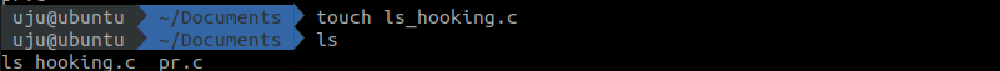
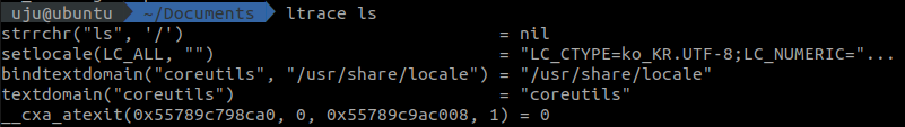
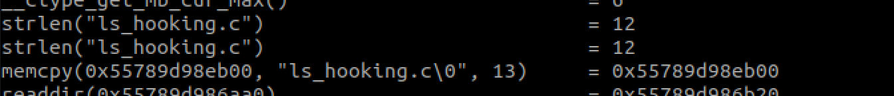
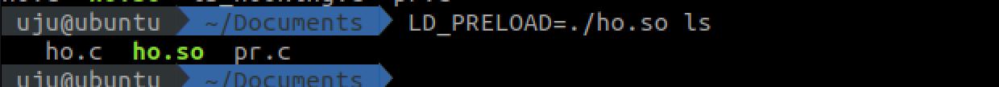
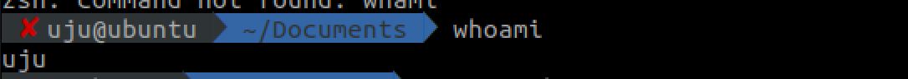
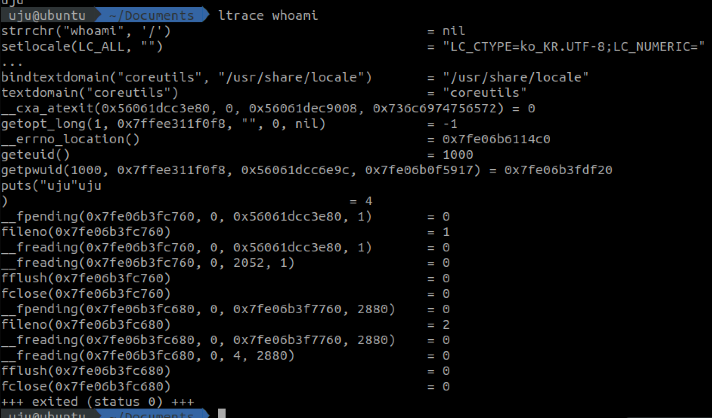
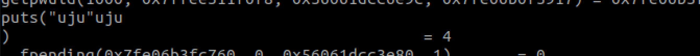
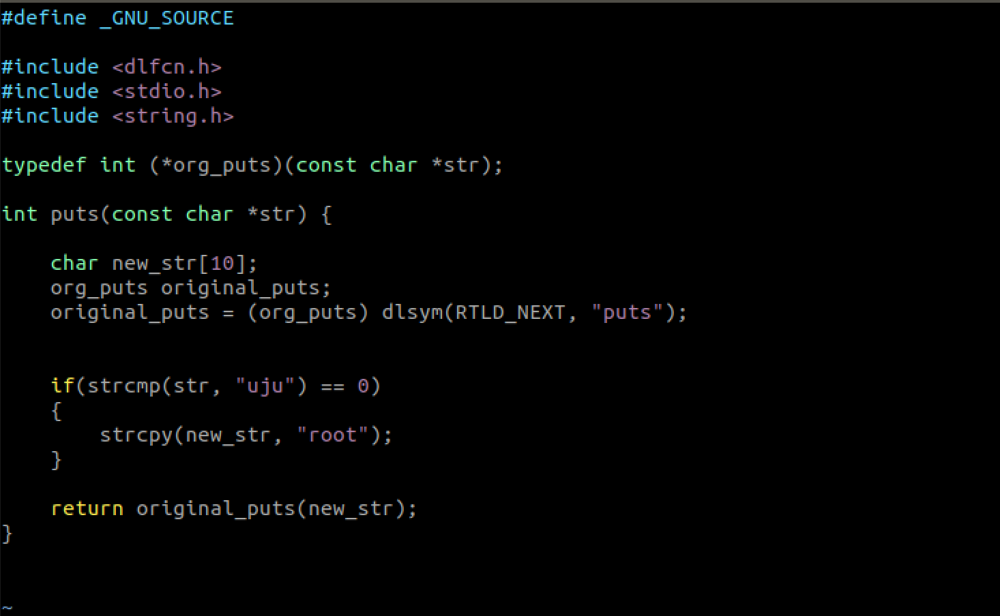
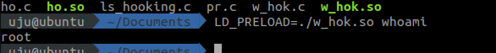

# C_Hooking
----------
Test Environment
```
Ubuntu 18.04 LTS
```

##1. ls hooking
> ls 명령어를 통해 해당 디렉토리에 존재하는 파일명을 확인할 수 있다. 
> 

ls_hooking.c 파일을 ls명령어를 입력하더라도 보이지 않도록 해보겠다. 
>

살펴보니 memcpy 함수를 거쳐 ls가 동작함을 확인할 수 있다. 
>

memcpy 함수의 원형을 살펴보자.
```void *memcpy(void *_Dst, void const *_Src, size_t _Size);```
memcpy를 통해 각 파일명을 copy 함을 알 수 있다. 이 함수를 변조하여 숨기고 싶은 파일을 숨겨보겠다. 

코드를 구현해보자. 코드를 구현할 때 함수의 원형과 동일한 형태로 구현해야한다.

```c
#include <stdio.h>
#include <string.h>
void* memcpy(void* dest, const void *src, size_t count){
        char* dst8 = (char*)dest;
        char* src8 = (char*)src;
        if(strcmp(src,"ls_hooking.c")==0){
                return dest;
        }

        while (count--) {
            *dst8++ = *src8++;
        }

        return dest;
}
```

코드 구현 후 so파일을 만들기 위해 
```gcc -shared -fPIC -o ho.so ho.c```

수행결과 확인
```LD_PRELOAD=./hook.so ls```
이 환경변수를 사용해 라이브러리 로딩 순서를 바꿀 수 있다. 
>


## 2. whoami hooking

>
 whoami를 입력해보면 현재 사용자인 uju 가 출력됨을 확인할 수 있디. 

```ltrace whoami``` 를 이용해 명령어가 실행되는 과정을 확인하자. 



>
puts 함수를 통해 uju를 출력해주고 있다. 

puts 함수의 원형은 ```int puts(const char *str) ``` 이므로 원형 그대로를 이용한다. 



```gcc -shared -fPIC -o w_hok.so w_hok.c -ldl``` 사용하여 so 파일 만든다. 

실행 결과 확인
>